# D — Domain Map / Bounded Contexts

Fecha: 2026-09-27 · Fase 0 · Estado: `IMPLEMENTADO` (documento)  
Proyecto: `[PROJECT_NAME]` · Dominio: `[DOMAIN]` · Marca: `[BRAND_NAME]`

---

## 1. Mapa de Contextos Acotados (Bounded Contexts)

| # | Contexto | Responsabilidad Principal | Entidades Core | Eventos Producidos | Eventos Consumidos | Dependencias (Sync/Async) | Data Owner / Steward | Clasificación de Datos | Servicios por Fase |
|---|---|---|---|---|---|---|---|---|---|
| 1 | **identity** | Gestión de usuarios, autenticación, autorización, sesiones, MFA, API keys, dispositivos, RBAC | User, Credential, Session, Device, MfaFactor, ApiKey, Role, Permission, RoleAssignment, EmailVerification, PasswordReset | UserRegistered, UserEmailVerified, UserLoggedIn, LoginFailed, MfaEnabled, MfaDisabled, SessionRevoked, PasswordResetRequested, PasswordResetCompleted, ApiKeyCreated, ApiKeyRevoked | — | Sync: gateway (JWT validation). Async: audit, notification, kyc, risk | Platform/Identity Team · Steward: CISO | CONFIDENTIAL (PII, credenciales, device fingerprint) | F1: identity (IMPLEMENTADO) |
| 2 | **accounts** | Cuentas de trading (live/demo), perfiles, jurisdicción, límites por cuenta, estado KYC vinculado | TradingAccount, Profile, Jurisdiction, AccountLimit, AccountStatus (ref), KycLink | AccountCreated, DemoAccountCreated, DemoBalanceReset | UserRegistered, KycApproved, KycRejected | Sync: identity (user lookup), kyc (status). Async: wallet, ledger, risk, notification, audit | Trading/Accounts · Steward: Head of Trading | CONFIDENTIAL (jurisdicción, leverage, tipo cuenta) | F2: accounts (PENDIENTE) |
| 3 | **wallet** | Balances multi-moneda (proyección verificable del ledger), snapshots, configuración de monedas, tasas de conversión | Balance, BalanceSnapshot, CurrencyConfig, ConversionRate | — | AccountCreated, DepositCompleted, WithdrawalCompleted, OrderFilled, PositionClosed, FeeCharged, SwapApplied, PnlRealized, LedgerPosted | Sync: ledger (verificación balance). Async: accounts, payments, trading, risk, audit | Trading/Wallet · Steward: CFO | CONFIDENTIAL (saldos, movimientos) | F2: wallet (PENDIENTE) |
| 4 | **ledger** | **Fuente de verdad financiera**: double-entry append-only, asientos inmutables, idempotencia, outbox, reconciliación diaria | LedgerAccount, LedgerTransaction, LedgerEntry, LedgerIdempotencyKey, LedgerBalanceSnapshot, OutboxEvent | LedgerPosted | DepositCompleted, WithdrawalCompleted, OrderFilled, PositionClosed, FeeCharged, SwapApplied, PnlRealized, MarginFunding | Sync: wallet (balance verification). Async: accounts, payments, trading, risk, audit, reporting, admin | Trading/Ledger · Steward: CFO/Compliance | **RESTRICTED** (asientos contables inmutables, dinero) | F2: ledger (PENDIENTE) |
| 5 | **payments** | Orquestación depósitos/retiros via adapters PSP, webhooks, fee schedules, métodos de pago | Deposit, Withdrawal, PspAdapter, PaymentMethod, PspWebhook, FeeSchedule | DepositRequested, DepositCompleted, DepositFailed, WithdrawalRequested, WithdrawalApproved, WithdrawalCompleted, WithdrawalRejected | AccountCreated, KycApproved, LedgerPosted | Sync: accounts (validación), kyc (tier), wallet (reserva), ledger (posting). Async: audit, notification, risk | Payments/Integrations · Steward: Head of Payments | CONFIDENTIAL (dinero, datos PSP, destino retiro) | F6: payments (PENDIENTE) |
| 6 | **market-data** | Adapters de proveedores, normalización, streaming WS, símbolos, ticks, velas, specs de instrumentos | Symbol, Tick, Candle, InstrumentSpec, ProviderStatus | MarketDataConnected, TickReceived, CandleClosed, SymbolUpdated | — | Sync: trading (price snapshot). Async: risk (precios para márgenes), admin (config) | Data/Market · Steward: Head of Data | INTERNAL (precios públicos pero operacionales) | F3: market-data (PENDIENTE) |
| 7 | **trading** | OMS (Order Management), EMS (Execution Management), posiciones, margen, PnL, comisiones, swaps | Order, Position, Execution, MarginAccount, OrderLeg, PositionHistory | OrderCreated, OrderAccepted, OrderRejected, OrderFilled, OrderCancelled, PositionOpened, PositionClosed, PnlRealized, FeeCharged, SwapApplied | Market data (precios), risk (límites), ledger (posting), wallet (balance check) | Sync: market-data (quote), risk (pre-trade check), ledger (post-trade posting). Async: wallet, audit, notification, risk, admin | Trading/OMS · Steward: Head of Trading | CONFIDENTIAL (órdenes, posiciones, PnL, margen) | F4: trading (PENDIENTE) |
| 8 | **risk** | Límites (posición, exposición, pérdida diaria, apalancamiento), circuit breakers, kill switches, margin calls, stop-outs | RiskLimit, LimitBreach, CircuitBreaker, KillSwitch, MarginCall, StopOut, RiskMetricsSnapshot | MarginCallTriggered, StopOutTriggered, RiskLimitExceeded | OrderCreated, OrderFilled, PositionOpened, PositionClosed, Market data prices, LedgerPosted, DepositCompleted, WithdrawalCompleted | Sync: trading (pre-trade validation), wallet (available margin). Async: audit, notification, admin, trading (kill switch) | Risk/Engine · Steward: CRO | CONFIDENTIAL (límites internos, brechas, acciones) | F4: risk (PENDIENTE) |
| 9 | **kyc-aml** | Orquestación KYC/AML con adapters de proveedores, screening, scoring, alertas, casos | KycCase, Document, Screening, ProviderResponse, RiskScore, AmlAlert | KycSubmitted, KycApproved, KycRejected | UserRegistered, AccountCreated | Sync: accounts (estado), identity (datos usuario). Async: audit, notification, risk, admin, payments (gate withdrawals) | Compliance/KYC · Steward: CCO | **RESTRICTED** (PII máximo, documentos, screening AML) | F6: kyc (PENDIENTE) |
| 10 | **notifications** | Email, SMS, push, in-app, webhooks via adapters, plantillas, preferencias, delivery tracking | Template, Channel, Delivery, Preference, WebhookEndpoint | NotificationSent, NotificationFailed, NotificationDelivered | Todos los eventos de negocio (user, account, trading, payments, risk, kyc) | Async: todos (consumidor universal). Sync: template rendering | Platform/Comms · Steward: Head of Product | INTERNAL (plantillas, logs entrega) | F2+: notification (PARCIAL) |
| 11 | **admin-backoffice** | BFF para backoffice: feature flags, config sistema, exports auditoría, users admin, roles | FeatureFlag, SystemConfig, AuditExport, AdminUser, RoleDefinition | FeatureFlagChanged, ConfigUpdated, AuditExportCompleted | Todos (lectura), audit (exports) | Sync: todos (read models). Async: identity (admin users) | Platform/Admin · Steward: CTO | CONFIDENTIAL (config, flags, exports) | F7: admin (PENDIENTE) |
| 12 | **crm-support** | Tickets, chats, conocimiento, SLA, satisfacción, integración con identity/accounts | Ticket, Conversation, KnowledgeArticle, SlaPolicy, CsatSurvey | TicketCreated, TicketResolved, ConversationStarted | UserRegistered, AccountCreated, KycApproved/Rejected | Sync: identity, accounts (contexto cliente). Async: notification | Support/CRM · Steward: Head of Support | CONFIDENTIAL (tickets con datos cliente) | F8+: crm-support (PENDIENTE) |
| 13 | **affiliate-ib** | Programa afiliados/IB: tracking, comisiones, multi-nivel, pagos, reportes | Affiliate, Referral, CommissionRule, CommissionPayout, Tier | AffiliateRegistered, ReferralCreated, CommissionCalculated, CommissionPaid | UserRegistered, AccountCreated, OrderFilled, FeeCharged | Sync: identity, accounts, trading (volumen). Async: payments (payout), ledger (comisiones), audit | Partnerships/Affiliate · Steward: Head of Partnerships | CONFIDENTIAL (comisiones, estructura red) | F8+: affiliate-ib (PENDIENTE) |
| 14 | **p2p** | Transferencias usuario-a-usuario, solicitudes, límites, compliance | P2pTransfer, P2pRequest, P2pLimit | P2pTransferRequested, P2pTransferCompleted, P2pTransferFailed | UserRegistered, AccountCreated, KycApproved, LedgerPosted | Sync: identity, accounts, ledger, risk. Async: notification, audit | Trading/P2P · Steward: Head of Trading | CONFIDENTIAL (transferencias entre usuarios) | F8+: p2p (PENDIENTE) |
| 15 | **bots-automation** | Trading bots, estrategias, backtesting, paper trading, webhooks, scheduling | Bot, Strategy, BacktestResult, PaperAccount, WebhookSubscription | BotCreated, StrategyDeployed, OrderCreated (via bot), BacktestCompleted | Market data, trading (order execution), risk (limits) | Sync: market-data, trading, risk. Async: notification, audit | Trading/Automation · Steward: Head of Trading | CONFIDENTIAL (estrategias, claves API bot) | F5: bots-automation (PENDIENTE) |
| 16 | **copy-trading** | Copy trading: líderes, seguidores, asignación proporcional, riesgo, pausar/cancelar | Leader, Follower, CopyRelation, AllocationConfig, CopyOrder | CopyRelationCreated, CopyOrderPlaced, CopyPositionSynced | UserRegistered, AccountCreated, OrderCreated, PositionOpened/Closed, RiskLimitExceeded | Sync: trading (ejecución), risk (límites follower). Async: wallet, ledger, notification, audit | Trading/Copy · Steward: Head of Trading | CONFIDENTIAL (copias, PnL seguidores) | F5: copy-trading (PENDIENTE) |
| 17 | **reporting-analytics** | Reportes regulatorios, fiscales, PnL, posiciones, exposición, dashboards, exports | ReportTemplate, ReportJob, RegulatoryFiling, TaxReport, AnalyticsSnapshot | ReportGenerated, ReportExported, RegulatoryFiled | LedgerPosted, OrderFilled, PositionOpened/Closed, FeeCharged, SwapApplied, PnlRealized, Deposit/Withdrawal | Async: ledger, trading, wallet, payments, kyc (lectura). Sync: admin (config) | Reporting/Analytics · Steward: CFO/Compliance | CONFIDENTIAL (reportes financieros, regulatorios) | F7+: reporting-analytics (PENDIENTE) |
| 18 | **jurisdictions** | Configuración por jurisdicción: regulaciones, monedas, KYC tiers, leverage caps, productos permitidos, impuestos | JurisdictionConfig, RegulationRule, ProductPermission, TaxRule, KycTierConfig | JurisdictionUpdated, RegulationChanged | — | Sync: accounts (validación), kyc (tier), trading (productos), payments (métodos). Async: admin | Legal/Compliance · Steward: CCO | INTERNAL (config regulatoria) | F2: jurisdictions (PENDIENTE) |
| 19 | **feature-flags** | Feature flags centralizadas, targeting, rollout %, kill switches, audit de cambios | FeatureFlag, FlagTargeting, FlagAuditLog | FeatureFlagChanged, FlagEvaluated | — | Sync: todos (evaluación runtime). Async: audit, admin | Platform/Infra · Steward: CTO | INTERNAL (flags, targeting rules) | F1: feature-flags (IMPLEMENTADO en gateway/identity) |
| 20 | **audit** | Log append-only inmutable de acciones críticas, event subscriptions, integrity chain, exports | LogEntry, EventSubscription, IntegrityChain, ExportJob | — | **Todos los eventos del sistema** (consumidor universal) | Async: todos (productores). Sync: admin (exports) | Platform/Observability · Steward: CISO/Audit | **RESTRICTED** (log inmutable, trazabilidad completa) | F1: audit (IMPLEMENTADO) |

---

## 2. Diagrama de Contextos y Flujo de Eventos (Mermaid)

```mermaid
graph TB
    subgraph EXTERNAL["Actores Externos"]
        TRADER[Trader / Usuario Final]
        ADMIN[Admin / Backoffice]
        APIDEV[Desarrollador API]
        MD_PROV[Proveedor Market Data]
        PAY_PROV[Proveedor Pagos PSP]
        KYC_PROV[Proveedor KYC/AML]
        LIQ_PROV[Liquidez / Ejecución]
        MSG_PROV[Email / SMS / Push]
        SIEM[SIEM / SOC]
    end

    subgraph IDENTITY["identity (F1)"]
        ID_SVC[identity service]
        ID_DB[(PostgreSQL: identity)]
        ID_RD[(Redis: sessions/rate-limit)]
    end

    subgraph GATEWAY["gateway (F1)"]
        GW[gateway: routing, JWT, rate-limit, request-id]
    end

    subgraph AUDIT["audit (F1)"]
        AUD_SVC[audit service]
        AUD_DB[(PostgreSQL: audit)]
    end

    subgraph ACCOUNTS["accounts (F2)"]
        ACC_SVC[accounts service]
        ACC_DB[(PostgreSQL: accounts)]
    end

    subgraph WALLET["wallet (F2)"]
        WAL_SVC[wallet service]
        WAL_DB[(PostgreSQL: wallet)]
    end

    subgraph LEDGER["ledger (F2)"]
        LED_SVC[ledger service]
        LED_DB[(PostgreSQL: ledger)]
    end

    subgraph MARKET["market-data (F3)"]
        MD_SVC[market-data service]
        MD_DB[(PostgreSQL+TimescaleDB: market_data)]
    end

    subgraph TRADING["trading (F4)"]
        TRD_SVC[trading service]
        TRD_DB[(PostgreSQL: trading)]
    end

    subgraph RISK["risk (F4)"]
        RSK_SVC[risk service]
        RSK_DB[(PostgreSQL: risk)]
    end

    subgraph PAYMENTS["payments (F6)"]
        PAY_SVC[payments service]
        PAY_DB[(PostgreSQL: payments)]
    end

    subgraph KYC["kyc-aml (F6)"]
        KYC_SVC[kyc service]
        KYC_DB[(PostgreSQL: kyc)]
    end

    subgraph NOTIF["notification (F2+)"]
        NOT_SVC[notification service]
        NOT_DB[(PostgreSQL: notification)]
    end

    subgraph ADMIN["admin-backoffice (F7)"]
        ADM_SVC[admin service]
        ADM_DB[(PostgreSQL: admin)]
    end

    subgraph INFRA["Infraestructura Transversal"]
        RP[(Redpanda: Event Log)]
        OTEL[OTel Collector]
        PROM[Prometheus]
        GRAF[Grafana]
        LOKI[Loki]
        TEMPO[Tempo]
        S3[(S3-compatible Object Storage)]
    end

    %% Flujos principales
    TRADER -->|HTTPS/WSS| GW
    ADMIN -->|HTTPS| GW
    APIDEV -->|HTTPS + API Key| GW
    MD_PROV -->|WS/REST| MD_SVC
    PAY_PROV -->|Webhook/REST| PAY_SVC
    KYC_PROV -->|Webhook/REST| KYC_SVC
    LIQ_PROV -->|FIX/WS/REST| TRD_SVC
    MSG_PROV -->|API| NOT_SVC
    SIEM -->|OTLP| OTEL

    GW -->|JWT validation| ID_SVC
    GW -->|Route| ACC_SVC
    GW -->|Route| WAL_SVC
    GW -->|Route| TRD_SVC
    GW -->|Route| PAY_SVC
    GW -->|Route| KYC_SVC
    GW -->|Route| ADM_SVC
    GW -->|Route| NOT_SVC

    ID_SVC -->|Events| RP
    ACC_SVC -->|Events| RP
    WAL_SVC -->|Events| RP
    LED_SVC -->|Events| RP
    MD_SVC -->|Events| RP
    TRD_SVC -->|Events| RP
    RSK_SVC -->|Events| RP
    PAY_SVC -->|Events| RP
    KYC_SVC -->|Events| RP
    NOT_SVC -->|Events| RP
    ADM_SVC -->|Events| RP

    RP -->|Consume| AUD_SVC
    RP -->|Consume| WAL_SVC
    RP -->|Consume| RSK_SVC
    RP -->|Consume| TRD_SVC
    RP -->|Consume| NOT_SVC
    RP -->|Consume| ADM_SVC

    LED_SVC -->|Sync verify| WAL_SVC
    TRD_SVC -->|Sync pre-trade| RSK_SVC
    TRD_SVC -->|Sync post-trade| LED_SVC
    TRD_SVC -->|Sync quote| MD_SVC
    PAY_SVC -->|Sync reserve| WAL_SVC
    PAY_SVC -->|Sync post| LED_SVC
    KYC_SVC -->|Sync status| ACC_SVC

    ID_SVC -->|OTLP| OTEL
    GW -->|OTLP| OTEL
    AUD_SVC -->|OTLP| OTEL
    TRD_SVC -->|OTLP| OTEL
    RSK_SVC -->|OTLP| OTEL
    PAY_SVC -->|OTLP| OTEL
    KYC_SVC -->|OTLP| OTEL

    OTEL --> PROM
    OTEL --> LOKI
    OTEL --> TEMPO
    PROM --> GRAF
    LOKI --> GRAF
    TEMPO --> GRAF

    AUD_SVC -->|Export| S3
    LED_SVC -->|Snapshots| S3
    KYC_SVC -->|Docs| S3
    NOT_SVC -->|Templates| S3
```

---

## 3. Matriz de Propiedad de Datos y Clasificación (Resumen Ejecutivo)

| Contexto | Data Owner | Data Steward | Clasificación Predominante | Retención Mínima | Cifrado en Reposo |
|---|---|---|---|---|---|
| identity | Platform/Identity | CISO | CONFIDENTIAL | 7 años (login history) | Sí (PII, credenciales) |
| accounts | Trading/Accounts | Head of Trading | CONFIDENTIAL | 7 años | Sí (jurisdicción, leverage) |
| wallet | Trading/Wallet | CFO | CONFIDENTIAL | 7 años | Sí (saldos) |
| ledger | Trading/Ledger | CFO/Compliance | **RESTRICTED** | **PERMANENTE** | Sí (fuente verdad) |
| payments | Payments/Integrations | Head of Payments | CONFIDENTIAL | 7 años | Sí (dinero, PSP) |
| market-data | Data/Market | Head of Data | INTERNAL | 2 años (ticks), 7 años (velas) | No (público) |
| trading | Trading/OMS | Head of Trading | CONFIDENTIAL | 7 años | Sí (órdenes, PnL) |
| risk | Risk/Engine | CRO | CONFIDENTIAL | 7 años | Sí (límites, brechas) |
| kyc-aml | Compliance/KYC | CCO | **RESTRICTED** | 7 años (regulatorio) | Sí (PII máximo) |
| notification | Platform/Comms | Head of Product | INTERNAL | 90 días (logs) | No (plantillas) |
| admin-backoffice | Platform/Admin | CTO | CONFIDENTIAL | 7 años | Sí (config, flags) |
| audit | Platform/Observability | CISO/Audit | **RESTRICTED** | 7 años | Sí (log inmutable) |

> **Nota**: Los contextos `crm-support`, `affiliate-ib`, `p2p`, `bots-automation`, `copy-trading`, `reporting-analytics`, `jurisdictions`, `feature-flags` heredan clasificación del dato que manipulan (mínimo CONFIDENTIAL para datos de cliente/dinero).

---

## 4. Servicios por Fase (Extracto de 00-decisions.md §3 + Extensiones)

| Fase | Servicios Nuevos | Contextos Activados | Nota |
|---|---|---|---|
| **F1 Foundation** | `gateway`, `identity`, `audit`, `feature-flags` (embebido) | identity, audit | Base: auth, routing, observabilidad, flags |
| **F2 Account + Demo** | `accounts`, `wallet`, `ledger`, `notification`, `jurisdictions` | accounts, wallet, ledger, notification, jurisdictions | Cuentas demo, balances, ledger, notifs |
| **F3 Market Data** | `market-data` | market-data | Adapters, normalización, streaming |
| **F4 Trading Demo** | `trading`, `risk` | trading, risk | OMS/EMS, posiciones, margen, risk engine |
| **F5 Automation** | `bots-automation`, `copy-trading` | bots-automation, copy-trading | Bots, copy trading (solo DEMO) |
| **F6 Payments/KYC** | `payments`, `kyc` | payments, kyc-aml | Depósitos/retiros reales, KYC obligatorio |
| **F7 Backoffice** | `admin-backoffice`, `reporting-analytics` | admin-backoffice, reporting-analytics | BFF admin, reportes regulatorios |
| **F8 Production Hardening** | `crm-support`, `affiliate-ib`, `p2p` | crm-support, affiliate-ib, p2p | Soporte, afiliados, P2P |
| **F9 Live Integration** | — | Todos | Licencias, proveedores LIVE, go-live |

---

## 5. Decisiones Pendientes por Contexto

| Contexto | Tema Pendiente | Estado |
|---|---|---|
| identity | Passkeys/WebAuthn | `PENDIENTE` |
| identity | Social login (Google/Apple) | `DECIDIR` |
| accounts | Multi-jurisdicción data residency | `REQUIERE REGULACIÓN` |
| wallet | Conversión FX automática | `DECIDIR` |
| ledger | Hash chain tamper-evidence | `DECIDIR` |
| ledger | Particionado temporal (pg_partman) | `PENDIENTE` |
| market-data | Proveedor principal (feed) | `REQUIERE PROVEEDOR` |
| market-data | TimescaleDB managed vs self-hosted | `DECIDIR` |
| trading | Motor de matching interno vs externo | `REQUIERE PROVEEDOR` |
| trading | Tipos de orden avanzados (OCO, bracket) | `PENDIENTE` |
| risk | Modelo de riesgo VaR/ES | `DECIDIR` |
| payments | PSP principal (acquiring) | `REQUIERE PROVEEDOR` |
| payments | Métodos: card, bank, crypto, local | `DECIDIR` |
| kyc-aml | Proveedor KYC (Jumio/Onfido/Sumsub/other) | `REQUIERE PROVEEDOR` |
| kyc-aml | Proveedor AML screening | `REQUIERE PROVEEDOR` |
| notification | Proveedor email (SendGrid/Mailgun/SES) | `REQUIERE PROVEEDOR` |
| notification | Proveedor SMS (Twilio/Vonage/other) | `REQUIERE PROVEEDOR` |
| notification | Push (FCM/APNs) | `DECIDIR` |
| admin-backoffice | RBAC granular por recurso | `PENDIENTE` |
| reporting-analytics | ClickHouse deployment | `DECIDIR` |
| jurisdictions | Mapa regulatorio inicial (países) | `REQUIERE REGULACIÓN` |
| feature-flags | Proveedor flags (LaunchDarkly/Unleash/self) | `DECIDIR` |

---

*Fin del documento D-domain-map.md*