# E — C4 Context Diagram

Fecha: 2026-09-27 · Fase 0 · Estado: `IMPLEMENTADO` (documento)  
Proyecto: `MonedasAR` · Dominio: `[DOMAIN]` · Marca: `MonedasAR`

---

## 1. Diagrama de Contexto C4 (Mermaid)

```mermaid
C4Context
    title Diagrama de Contexto — MonedasAR (Plataforma Derivados OTC)

    Person(trader, "Trader / Usuario Final", "Opera vía Web/PWA: registro, login, cuenta demo/live, trading, wallet, reportes")
    Person(admin, "Admin / Backoffice", "Gestiona usuarios, cuentas, riesgo, KYC, feature flags, auditoría, reportes regulatorios")
    Person(apidev, "Desarrollador API", "Integravia REST/WebSocket: market data, trading, account management, webhooks")
    
    System_Ext(mdprov, "Proveedor Market Data", "Feed de precios (ticks, velas, specs) via WS/REST/FIX. Ej: `REQUIERE PROVEEDOR`")
    System_Ext(payprov, "Proveedor Pagos (PSP)", "Acquiring: tarjetas, transferencias, APM, crypto. Webhooks asíncronos. Ej: `REQUIERE PROVEEDOR`")
    System_Ext(kycprov, "Proveedor KYC/AML", "Verificación identidad, screening AML, scoring. Webhooks/callbacks. Ej: `REQUIERE PROVEEDOR`")
    System_Ext(liqprov, "Liquidez / Ejecución", "Motor de matching / LP externo. FIX/WS/REST. Ej: `REQUIERE PROVEEDOR`")
    System_Ext(msgprov, "Email / SMS / Push", "Canales notificación transaccional y marketing. Ej: `REQUIERE PROVEEDOR`")
    System_Ext(siem, "SIEM / SOC", "Ingesta logs, traces, métricas, alertas de seguridad. OTLP/HTTP")

    System_Boundary(b0, "MonedasAR — Sistema Core") {
        System(gateway, "Gateway", "Edge: TLS termination, routing, JWT validation, rate limit, headers seguridad, request-id, OTel")
        System(identity, "Identity", "Usuarios, credenciales, sesiones, MFA, RBAC, API keys, devices, login history")
        System(audit, "Audit", "Log append-only inmutable de acciones críticas, event subscriptions, integrity chain, exports")
        System(accounts, "Accounts", "Cuentas trading live/demo, perfiles, jurisdicción, límites, estado KYC")
        System(wallet, "Wallet", "Balances multi-moneda (proyección verificada del ledger), snapshots, conversión")
        System(ledger, "Ledger", "Fuente verdad financiera: double-entry append-only, idempotencia, outbox, reconciliación")
        System(marketdata, "Market Data", "Adapters proveedores, normalización, streaming WS, símbolos, ticks, velas")
        System(trading, "Trading", "OMS/EMS, posiciones, margen, PnL, comisiones, swaps, execution management")
        System(risk, "Risk", "Límites, circuit breakers, kill switches, margin calls, stop-outs, pre-trade checks")
        System(payments, "Payments", "Orquestación depósitos/retiros via adapters PSP, fee schedules, métodos pago")
        System(kyc, "KYC/AML", "Orquestación KYC/AML con adapters proveedor, casos, documentos, screening")
        System(notification, "Notification", "Email/SMS/push/in-app/webhook via adapters, plantillas, preferencias, tracking")
        System(admin, "Admin Backoffice", "BFF: feature flags, config sistema, exports auditoría, usuarios admin, RBAC")
    }

    Rel(trader, gateway, "HTTPS / WSS", "Registro, login, trading, wallet, cuenta demo")
    Rel(admin, gateway, "HTTPS", "Backoffice, gestión usuarios, riesgo, KYC, flags, auditoría")
    Rel(apidev, gateway, "HTTPS + API Key", "REST/WebSocket: market data, orders, positions, account, webhooks")
    
    Rel(gateway, identity, "gRPC/HTTP interno", "Validación JWT, introspección sesión, RBAC")
    Rel(gateway, accounts, "gRPC/HTTP interno", "CRUD cuentas, límites, jurisdicción")
    Rel(gateway, wallet, "gRPC/HTTP interno", "Consulta balances, historial, conversión")
    Rel(gateway, trading, "gRPC/HTTP interno", "Envío órdenes, consulta posiciones, PnL")
    Rel(gateway, payments, "gRPC/HTTP interno", "Iniciar depósito/retiro, estado, métodos")
    Rel(gateway, kyc, "gRPC/HTTP interno", "Iniciar KYC, consultar estado, documentos")
    Rel(gateway, notification, "gRPC/HTTP interno", "Preferencias, historial notificaciones")
    Rel(gateway, admin, "gRPC/HTTP interno", "Feature flags, config, exports, admin users")
    Rel(gateway, marketdata, "gRPC/HTTP interno", "Snapshot precios, suscripción streaming")
    
    Rel(identity, audit, "Async: Redpanda", "Eventos: UserRegistered, UserLoggedIn, MfaEnabled, ApiKeyCreated, etc.")
    Rel(accounts, audit, "Async: Redpanda", "Eventos: AccountCreated, DemoAccountCreated, DemoBalanceReset")
    Rel(wallet, audit, "Async: Redpanda", "Eventos: BalanceUpdated (proyección)")
    Rel(ledger, audit, "Async: Redpanda", "Eventos: LedgerPosted (fuente verdad)")
    Rel(trading, audit, "Async: Redpanda", "Eventos: OrderCreated, OrderFilled, PositionOpened/Closed, FeeCharged, SwapApplied")
    Rel(risk, audit, "Async: Redpanda", "Eventos: MarginCallTriggered, StopOutTriggered, RiskLimitExceeded")
    Rel(payments, audit, "Async: Redpanda", "Eventos: DepositRequested/Completed/Failed, WithdrawalRequested/Approved/Completed/Rejected")
    Rel(kyc, audit, "Async: Redpanda", "Eventos: KycSubmitted, KycApproved, KycRejected")
    Rel(notification, audit, "Async: Redpanda", "Eventos: NotificationSent/Delivered/Failed")
    Rel(admin, audit, "Async: Redpanda", "Eventos: FeatureFlagChanged, ConfigUpdated, AuditExportCompleted")
    
    Rel(marketdata, mdprov, "WS/REST/FIX", "Suscripción feed tiempo real, histórico, specs instrumentos")
    Rel(payments, payprov, "REST + Webhooks", "Crear cargo, reembolso, consultar estado; recibir callbacks async")
    Rel(kyc, kycprov, "REST + Webhooks", "Enviar documentos, consultar resultado; recibir callbacks async")
    Rel(trading, liqprov, "FIX/WS/REST", "Envío órdenes, ejecución, confirmaciones, market data privado")
    Rel(notification, msgprov, "REST/API", "Enviar email, SMS, push; recibir delivery receipts")
    Rel(gateway, siem, "OTLP/HTTP", "Traces, métricas, logs estructurados, alertas seguridad")
    Rel(identity, siem, "OTLP/HTTP", "Eventos seguridad: login, MFA, API keys, fallos")
    Rel(audit, siem, "OTLP/HTTP", "Log inmutable acciones críticas para correlación")
    Rel(trading, siem, "OTLP/HTTP", "Eventos trading: órdenes, posiciones, risk actions")
    Rel(risk, siem, "OTLP/HTTP", "Alertas risk: margin calls, stop-outs, limit breaches")
```

---

## 2. Notas de Flujo (Flow Notes)

| # | Flujo | Descripción | Protocolo | Seguridad |
|---|---|---|---|---|
| 1 | **Registro → Login → Sesión** | Usuario crea cuenta → verifica email → login (password + opcional MFA) → recibe access token (≤15 min) + refresh token rotativo | HTTPS, WSS | Argon2id, JWT RS256, refresh rotation + reuse detection, rate limit IP/account |
| 2 | **Cuenta Demo → Orden Demo → Posición → PnL** | Usuario solicita cuenta demo → se crea con balance virtual → envía orden → OMS valida risk pre-trade → EMS ejecuta contra market data demo → posición abierta → PnL real-time → fees/swaps → cierre posición | HTTPS, WSS | Feature flag `demo_trading=true`, risk limits demo, no dinero real |
| 3 | **Depósito Real (Fase 6+)** | Usuario inicia depósito → pagos crea intent → redirige a PSP → usuario paga → PSP webhook → payments valida → wallet reserva → ledger posta asiento → balance actualizado → notificación | HTTPS, Webhooks | Idempotency-Key, verificación firma PSP, PCI DSS (delegado a PSP), KYC approved requerido |
| 4 | **Retiro Real (Fase 6+)** | Usuario solicita retiro → validaciones: KYC approved, límites, saldo disponible → risk aprueba → payments procesa con PSP → ledger posta asiento → balance actualizado → notificación | HTTPS, Webhooks | MFA obligatorio, aprobador humano (opcional config), idempotencia, AML screening |
| 5 | **Market Data Streaming** | market-data conecta a proveedor → normaliza → publica ticks/velas en Redpanda + WS a clientes → trading consume para pricing/ejecución → risk consume para márgenes | WS (proveedor), WSS (clientes), Redpanda (interno) | TLS mutuo con proveedor, rate limit, circuit breaker si feed cae |
| 6 | **Trading Live (Bloqueado hasta F9)** | Orden → risk pre-trade (límites, margen) → OMS acepta → EMS routea a liquidez → execution → ledger posta → position update → risk post-trade → notificaciones | HTTPS, WSS, FIX | Feature flag `live_trading=false` por defecto, requiere licencia, contratos, proveedores reales |
| 7 | **Auditoría y Trazabilidad** | Todo evento crítico → transactional outbox → Redpanda → audit consume → log inmutable (integrity chain) → exports regulatorios → SIEM correlaciona | Redpanda, OTLP | Append-only, hash chain opcional, retención 7 años, cifrado en reposo |
| 8 | **Observabilidad** | Todos los servicios → OTel Collector → Prometheus (métricas), Loki (logs), Tempo (traces) → Grafana dashboards → alertas → SIEM | OTLP/gRPC, OTLP/HTTP | TLS, sampling configurable, PII scrubbing en logs |

---

## 3. Límites del Sistema (System Boundary)

- **Dentro del boundary**: Todos los servicios listados en `00-decisions.md` §3 + extensiones (`notification`, `admin-backoffice`, `feature-flags`, `jurisdictions`, `bots-automation`, `copy-trading`, `reporting-analytics`, `crm-support`, `affiliate-ib`, `p2p`).
- **Fuera del boundary**: Proveedores externos (market data, PSP, KYC, liquidez, email/SMS/push), SIEM, navegadores/clientes, infraestructura cloud (K8s, DNS, CDN, WAF, Vault, S3).
- **Responsabilidad compartida**:
  - **Seguridad de red**: WAF, DDoS protection, mTLS entre servicios (infra) vs. validación JWT, rate limit, headers (gateway).
  - **Datos**: Cifrado en reposo (infra/volumes) vs. clasificación, manejo, retención (aplicación).
  - **Disponibilidad**: K8s HA, multi-AZ (infra) vs. circuit breakers, degradación graceful, feature flags (aplicación).

---

## 4. Decisiones de Contexto Pendientes

| Tema | Estado | Detalle |
|---|---|---|
| Dominio TLS público (`[DOMAIN]`) | `DECIDIR` | Certificados, CA, HSTS, CAA, CT logs |
| WAF / DDoS provider | `REQUIERE PROVEEDOR` | Cloudflare / AWS Shield / Azure Front Door / self-hosted |
| CDN para assets estáticos | `DECIDIR` | CloudFront / Cloudflare / Bunny / self-hosted |
| DNS provider | `REQUIERE PROVEEDOR` | Route53 / Cloudflare / Azure DNS / other |
| Regiones de despliegue (data residency) | `REQUIERE REGULACIÓN` | Jurisdicciones objetivo → regiones cloud permitidas |
| Certificados mTLS internos | `DECIDIR` | SPIFFE/SPIRE, cert-manager, HashiCorp Vault PKI |
| SIEM integración concreta | `REQUIERE PROVEEDOR` | Splunk / Elastic / Datadog / Sentinel / self-hosted |

---

*Fin del documento E-c4-context.md*