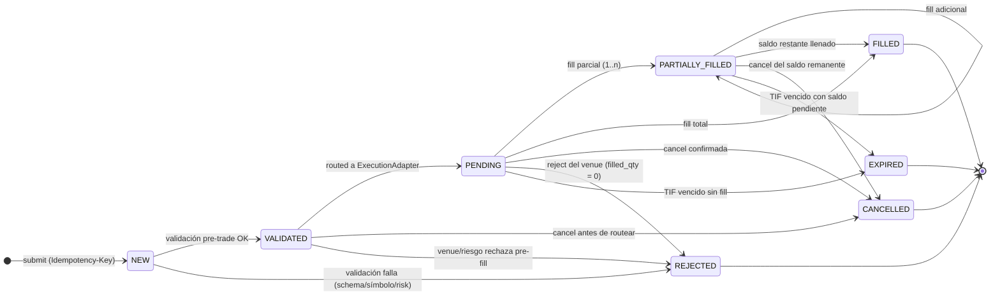
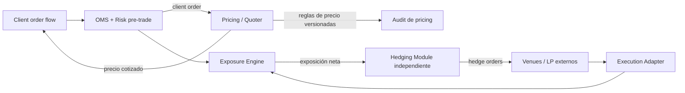

# H — Arquitectura de Trading (OMS · EMS · Margin · Risk · Positions)

Fecha: 2026-09-27 · Fase 0 · Estado: `IMPLEMENTADO` (documento)
Proyecto: `MonedasAR` · Dominio: `[DOMAIN]` · Marca: `MonedasAR`
Servicios: `trading` (OMS/EMS/posiciones/margen/PnL) y `risk` (límites/circuit breakers) — catálogo `00-decisions.md` §3 (Fase 4).
Fuentes: `00-decisions.md`, `L-ledger-architecture.md`, `P-event-catalog.md`, `B-requirements-matrix.md` (REQ-029…REQ-038, REQ-101, REQ-102).

> **Afirmación de alcance (no negociable):** este documento es **diseño**. **No existe acceso a mercados reales**: sin proveedor de liquidez/venue autorizado y sin licencia regulatoria, toda ejecución es interna y determinista (`mode=DEMO`) o está bloqueada (`mode=LIVE`, `feature_flag live_trading=false`).

---

## 1. Principios

| # | Principio | Consecuencia de diseño |
|---|---|---|
| 1 | El **Ledger** es la única fuente de verdad financiera | Toda operación económica del trading produce un asiento double-entry (`L-ledger-architecture.md`); posiciones/márgenes son derivados verificables |
| 2 | Idempotencia obligatoria en flujos financieros | `Idempotency-Key` + `client_order_id` + hash de solicitud en órdenes, cancelaciones y fills |
| 3 | Cero `float` | Cantidades/precios en `decimal.Decimal`; persistencia `NUMERIC(38,18)` |
| 4 | Desacoplamiento por adapter | OMS no conoce proveedores; solo `ExecutionAdapter` |
| 5 | Determinismo en DEMO | Mismo motor que LIVE, distinto adapter; resultados reproducibles y etiquetados `simulated` |
| 6 | Reglas de riesgo configurables, nunca hardcodeadas | Tablas de configuración versionadas por instrumento/cuenta/entidad/jurisdicción/nivel de riesgo |
| 7 | Precio de la casa nunca manipulado | Ver §7.3: pricing derivado de reglas transparentes y auditables, jamás de PnL de un cliente |

---

## 2. OMS (Order Management System)

### 2.1 Tipos de orden

| Tipo | Campos requeridos (además de base) | Disparador de ejecución | TIF aplicables | Fase |
|---|---|---|---|---|
| `MARKET` | `quantity` | inmediato al precio disponible | `IOC`, `FOK` | 2/4 |
| `LIMIT` | `quantity`, `price` | precio de mercado toca/atraviesa `price` | `GTC`, `IOC`, `FOK`, `GTD` | 2/4 |
| `STOP` | `quantity`, `stop_price` | precio toca `stop_price` → se convierte en `MARKET` | `GTC`, `GTD` | 2/4 |
| `STOP_LIMIT` | `quantity`, `stop_price`, `price` | `stop_price` tocado → se convierte en `LIMIT` | `GTC`, `GTD` | 4 |
| `TAKE_PROFIT` | `quantity`, `price` (reduce-only) | precio toca `price` en dirección favorable → `LIMIT` | `GTC`, `GTD` | 2/4 |
| `STOP_LOSS` | `quantity` (`stop_price` o `price` reduce-only) | precio toca la barrera en dirección desfavorable → `MARKET`/`LIMIT` | hasta cierre | 2/4 |
| `TRAILING_STOP` | `quantity`, `trail_offset` (+`trail_percent`), `activation_price?` | stop móvil que sigue el precio en distancia/porcentaje fijo | hasta cierre | 4 |
| `OCO` (par bracket) | dos órdenes hermanas (`take_profit` + `stop_loss`) | ejecución/cancelación de una ⇒ cancelación automática de la otra | derivado | 4 |

Reglas:
- `reduce_only=true` obligatorio en `TAKE_PROFIT`/`STOP_LOSS` ligadas a una posición (no abren exposición nueva).
- `OCO` se modela como **grupo de órdenes** (`group_id` + `group_type='OCO'`); la cancelación cruzada es transacción única atómica sobre ambas órdenes.
- Prohibida toda orden cuyo resultado neto no sea evaluable por el Risk Engine pre-trade (REQ-029).

### 2.2 Máquina de estados

Estados: `NEW`, `VALIDATED`, `REJECTED`, `PENDING`, `PARTIALLY_FILLED`, `FILLED`, `CANCELLED`, `EXPIRED`.



**Transiciones permitidas** (únicas rutas legales; toda actualización es `compare-and-set` sobre `status` versionado):

| Origen | Destino | Condición |
|---|---|---|
| `NEW` | `VALIDATED` | schema + instrumento + límites + margen pre-trade OK |
| `NEW` | `REJECTED` | cualquier validación falla; `filled_quantity=0` |
| `VALIDATED` | `PENDING` | enviada al adapter, aún sin fill |
| `VALIDATED` | `CANCELLED`/`REJECTED` | cancel de usuario o imposibilidad de routear |
| `PENDING` | `PARTIALLY_FILLED`/`FILLED` | execution report con `fill_qty>0` |
| `PENDING` | `CANCELLED`/`REJECTED`/`EXPIRED` | sin fills acumulados |
| `PARTIALLY_FILLED` | `PARTIALLY_FILLED`/`FILLED`/`CANCELLED`/`EXPIRED` | con `0 < filled_quantity < quantity` |

**Transiciones prohibidas** (rechazadas por test de máquina de estados, REQ-029):

| Prohibida | Razón |
|---|---|
| `NEW → PENDING` / `NEW → FILLED` / `NEW → PARTIALLY_FILLED` | salta la validación pre-trade |
| `VALIDATED → FILLED` / `VALIDATED → PARTIALLY_FILLED` | debe pasar por ejecución (`PENDING`) |
| `NEW/VALIDATED → CANCELLED` sin evento de cancelación registrado | requiere `OrderCancelled` auditado |
| `PARTIALLY_FILLED → REJECTED` | ya hay fills: no puede ser rechazo total (solo cancel/expiry) |
| `FILLED → *`, `CANCELLED → *`, `REJECTED → *`, `EXPIRED → *` | estados terminales; sin reversión (corrección = nueva orden/ajuste) |
| Transición sin `fill_id` cuando el destino implica fills | trazabilidad de ejecución |
| Reutilizar `order_id` (terminal → `NEW`) | identidad única; reenvío nuevo = nuevo UUIDv7 |
| Transición con `status` observado desactualizado | prohibida: se exige CAS/optimistic locking |

Invariantes: `filled_quantity ≤ quantity`; `avg_fill_price = Σ(fill_qty·price)/filled_quantity`; `REJECTED` solo si `filled_quantity=0`; toda transición emite `Order*` del catálogo P (§9).

### 2.3 Campos obligatorios por orden

| Campo | Tipo | Obligatorio | Notas |
|---|---|---|---|
| `order_id` | UUIDv7 | ✅ | identidad primaria; sin IDs secuenciales públicos |
| `client_order_id` | string | ✅ | deduplicación en cliente/WS (REQ-101); único por cuenta + ventana |
| `idempotency_key` | string | ✅ | `Idempotency-Key` HTTP; hash de payload asociado; respuesta cacheada |
| `user_id` | UUIDv7 | ✅ | propietario |
| `trading_account_id` | UUIDv7 | ✅ | cuenta de trading (no confundir con usuario) |
| `instrument` | object | ✅ | `symbol` + `asset_class` + `venue/reference` del symbol master |
| `side` | enum | ✅ | `BUY` \| `SELL` |
| `order_type` | enum | ✅ | §2.1 |
| `quantity` | `NUMERIC(38,18)` | ✅ | > 0, tamaño del lote validado por instrumento |
| `price` | `NUMERIC(38,18)` | condicional | obligatorio en `LIMIT`, `STOP_LIMIT`, `TAKE_PROFIT` |
| `stop_price` | `NUMERIC(38,18)` | condicional | obligatorio en `STOP`, `STOP_LIMIT`, `STOP_LOSS`; derivado en `TRAILING_STOP` |
| `trail_offset` / `trail_percent` | numérico | condicional | solo `TRAILING_STOP` |
| `time_in_force` | enum | ✅ | `GTC`/`IOC`/`FOK`/`GTD`; `expire_at` requerido con `GTD` |
| `expire_at` | timestamptz UTC | condicional | base de `EXPIRED` |
| `created_at` / `updated_at` / `accepted_at?` / `filled_at?` | timestamptz UTC | ✅ (los 2 primeros) | **UTC canónico**, RFC3339 con microsegundos |
| `jurisdiction` | string | ✅ | determina límites y reglas aplicables (cuenta/entidad) |
| `execution_venue` / `provider` | string | ✅ | `INTERNAL_DEMO` en DEMO; identidad del venue/LP en LIVE |
| `correlation_id` | UUIDv7 | ✅ | trazabilidad extremo a extremo (envelope evento) |
| `mode` | enum | ✅ | `DEMO` \| `LIVE` (heredado de la cuenta; jamás inferido del precio) |
| `status` | enum | ✅ | §2.2 |
| `filled_quantity` / `avg_fill_price` | numérico | ✅ (default 0/null) | derivados de fills |
| `reduce_only` / `group_id` / `group_type` | bool/string | opcional | brackets/OCO y órdenes ligadas a posición |
| `metadata` | jsonb | opcional | extensible; sin PII innecesaria |

---

## 3. EMS desacoplado (Execution Management)

### 3.1 Interfaz `ExecutionAdapter`

```python
class ExecutionAdapter(Protocol):
    async def submit(self, cmd: SubmitOrder) -> ExecutionAck: ...
    async def cancel(self, cmd: CancelOrder) -> CancelAck: ...
    async def modify(self, cmd: AmendOrder) -> AmendAck: ...  # qty/precio si el venue lo permite
    async def status(self, ref: VenueOrderRef) -> VenueOrderState: ...  # consulta de verdad ante duda
    async def stream_fills(self, account_ref: str) -> AsyncIterator[FillReport]: ...
    def capabilities(self) -> AdapterCapabilities: ...  # tipos soportados, TIF, mercado, modo
```

| Implementación | Propósito | Estado |
|---|---|---|
| `InternalDemoExecutionAdapter` | Ejecución interna determinista contra libro simulado derivado del feed (mock/sintético) | `IMPLEMENTADO` (Fase 2/4, DEMO) |
| `LiquidityProviderAdapter` | Cotizaciones firmes/RFQ con LP (FIX/REST) | `REQUIERE PROVEEDOR` |
| `ExternalVenueAdapter` | Envío a venue/broker externo con smart routing | `REQUIERE PROVEEDOR` |

> **Afirmación explícita:** hasta tener proveedor/venue autorizado, licencia vigente y `live_trading=true`, **no existe acceso real a mercados**; `LiquidityProviderAdapter` y `ExternalVenueAdapter` permanecen fuera del camino de ejecución (código deshabilitado por gating de fase).

### 3.2 Routing, slippage, fills, rejects, timeouts y reintentos

| Tema | Diseño |
|---|---|
| **Routing** | Selección por capabilities + precio/latencia/costo configurados (tabla de reglas versionada, auditable). En DEMO: destino fijo `INTERNAL_DEMO`. Orden de preferencia configurable; fallback al siguiente candidato si el adapter falla/timeout. |
| **Slippage** | Límite de slippage pre-trade (`max_slippage_bps`) por orden; excedido ⇒ rechazo o parcial según TIF. En DEMO: modelo de impacto determinista declarado como simulado. En LIVE: medido vs. `mark_price` y reportado (best execution). |
| **Fills parciales** | Cada fill es evento propio (`fill_id`, `fill_qty`, `fill_price`, `venue_ts`, `recv_ts`); acumulación transaccional con CAS de estado; promedio calculado, nunca promediado dos veces. |
| **Rejects** | Clasificados: `VALIDATION`, `RISK`, `VENUE_UNAVAILABLE`, `NO_LIQUIDITY`, `PRICE_BAND`, `TIMEOUT_UNKNOWN`, `DUPLICATE`. Solo `filled_quantity=0` ⇒ `REJECTED`; con fills ⇒ `CANCELLED`/parcial. |
| **Timeouts** | Presupuesto por adapter (`submit_timeout_ms`, `cancel_timeout_ms`) con circuit breaker; en timeout **sin confirmación** el estado queda `PENDING` + `TIMEOUT_UNKNOWN`, nunca se asume cancelado ni ejecutado. |
| **Reintentos sin duplicar ejecución** | (1) reintento solo de idéntica petición con el mismo `client_order_id`/`idempotency_key`; (2) **antes de reenviar se consulta `status()`** en el venue; (3) sin respuesta a `status()` ⇒ no se reenvía, se escala a `RECONCILE_PENDING`; (4) backoff exponencial con jitter y límite de intentos; (5) jamás un reintento genera fill nuevo si el venue ya confirmó; (6) test obligatorio: replay HTTP/WS 100× ⇒ 1 orden, 0 fills fantasma (REQ-101). |
| **Execution reports** | Normalizados (`ExecutionReport`: order_id, exec_id, status, cum_qty, avg_px, leaves_qty, venue_ts, recv_ts, reason) y publicados como eventos (§9); WS al cliente con idempotencia por `exec_id`. |
| **Reconciliación de ejecuciones** | Job + stream: `fills` ↔ `positions` ↔ `ledger`. Reglas: todo fill ⇒ exactamente un asiento; fill huérfano ⇒ alerta + cuarentena (REQ-102); asiento sin fill ⇒ bloqueo del servicio afectado; diferencia venue↔interno ⇒ incidente `CRITICAL`. Conciliación con snapshot diario (`ledger_balance_snapshots`). |

---

## 4. Margin Engine

| Concepto | Fórmula / regla |
|---|---|
| **Initial margin (IM)** | `notional × IM%` por instrumento (o `notional / leverage_max`); se bloquea al abrir/aumentar |
| **Maintenance margin (MM)** | `notional × MM%`; umbral mínimo para mantener la posición |
| **Used margin** | `Σ margin inicial de posiciones abiertas (no incluye PnL) |
| **Free margin** | `equity − used margin`; `equity = balance_realizado + PnL_flotante` |
| **Margin level** | `equity / used margin × 100` (si `used margin = 0` ⇒ ∞/no aplica) |
| **Margin call** | `margin_level ≤ margin_call_threshold` ⇒ `MarginCallTriggered` (alerta, depósito exigible, no cierre automático) |
| **Stop-out** | `margin_level ≤ stop_out_threshold` ⇒ `StopOutTriggered`: cierre forzoso de posiciones (peor PnL primero) hasta restaurar el nivel; cierres asentados en ledger como cierres ordinarios |

- **Reglas configurables por**: `instrumento` (IM/MM, banda de precio, banda de precio), `cuenta` (nivel de riesgo/tier), `entidad` legal, `jurisdicción` (límites de apalancamiento permitidos) y `nivel de riesgo` (perfil del cliente). Fuente: tablas de configuración versionadas + auditoría de cambios (maker/checker), no constantes en código.
- Recalculado en cada fill, cada movimiento de balance y cada tick de mark (modo batched/coalesced con límite de frecuencia).
- Consumidor de `LedgerPosted` para equity; emite `MarginCallTriggered` y `StopOutTriggered` (catálogo P, `risk` como productor).
- **DEMO**: umbrales simulados pero el cálculo es el mismo código que LIVE.

---

## 5. Risk Engine

### 5.1 Límites pre-trade y post-trade

| `limit_type` | Ámbito de aplicación | Acción al superar |
|---|---|---|
| `max_position_notional` | por instrumento / por símbolo | reject orden (pre) / alerta (post) |
| `max_leverage` | cuenta / jurisdicción | reject |
| `max_daily_loss` | cuenta / usuario / entidad | reject + kill switch de cuenta |
| `max_gross_exposure` | cuenta / usuario | reject |
| `max_net_exposure` | símbolo / asset class / cliente | reject |
| `max_concentration` | % del book o del portfolio en 1 símbolo/asset class/contraparte | reject + obliga reducción |
| `max_symbol_position` | instrumento | reject |
| `max_account_exposure` | cuenta | reject |
| `jurisdiction_limits` | jurisdicción/entidad (productos permitidos, apalancamiento máximo) | reject + registro de cumplimiento |
| `velocity` | usuario/cuenta: órdenes/seg, ratio cancelación/fill, mensajes WS | throttle + bloqueo temporal + alerta fraude |

Emite `RiskLimitExceeded` con `current_value`, `threshold` y `action_taken` (catálogo P).

### 5.2 Detección de trading anómalo

Señales (score compuesto, umbrales configurables): pérdidas rápidas consecutivas (típico martingale), apertura/cierre inmediato de tamaño grande, órdenes canceladas a alta ratio (spoofing-like), tamaños fuera de perfil histórico, actividad fuera de horario/atípica por jurisdicción, clustering de cuentas correlacionadas, uso de latencia sospechosa vía automatización. Acciones: `ALERT` → `THROTTLE` → `BLOCK_NEW_ORDERS` → `FORCE_CLOSE_EVALUATION` → `KILL_SWITCH`. Toda decisión queda auditada (requiere razón y `correlation_id`).

### 5.3 Circuit breakers y kill switches

| Nivel | Ámbito | Efecto |
|---|---|---|
| **Global** | plataforma completa | bloquea nuevas órdenes en todos los mercados; posiciones existentes solo cancelables/cerrables |
| **Por mercado** | asset class / mercado / venue | bloquea órdenes de ese mercado (ej. feed caído, volatilidad extrema) |
| **Por usuario / cuenta** | usuario o cuenta individual | bloqueo individual (fraude, KYC revocado, margin call sostenido) |
| **Por instrumento** | símbolo concreto | suspensión puntual (stale price, banda rota) |

Además: **precio inválido** (fuera de banda del symbol master ⇒ rechazo), **stale price** (edad de tick > umbral ⇒ no se permite abrir exposición nueva), y **kill switch maestro** operable desde `admin` con doble aprobación y auditoría. Los circuit breakers son la primera defensa cuando el feed externo falla (fase con proveedor).

---

## 6. Position Engine (CFD / posiciones)

| Operación | Definición | Efectos |
|---|---|---|
| `open` | primera exposición neta en símbolo | reserva IM, `PositionOpened`, ledger `margin_funding` |
| `increase` | suma tamaño a posición existente (mismo lado) | recalcula precio medio ponderado, IM adicional |
| `reduce` | disminuye tamaño en el mismo lado | libera margen, PnL parcial realizado |
| `partial_close` | cierre parcial (`close_qty < size`) | `PositionClosed` parcial + `PnlRealized` proporcional |
| `full_close` | `close_qty = size` | posición a 0, todo el PnL realizado, libera margen íntegro |

| Concepto | Regla |
|---|---|
| **PnL flotante** | `long: (mark − entry) × size` · `short: (entry − mark) × size`; actualizado por tick con coalescing; en `Decimal` |
| **PnL realizado** | al `reduce`/`partial_close`/`full_close`/stop-out; base `avg_entry_price` → `exit_price` |
| **Fees** | comisión por fill + spread (cobrado en apertura/cierre según configuración); evento `FeeCharged` |
| **Swap / financiación** | cargo/abono nocturno por mantenimiento; evento `SwapApplied`; política configurable por símbolo y cuenta |
| **Margin** | reserva/ liberación según §4; `used margin` y `margin level` se recalculan por cada evento |
| **SL/TP** | órdenes bracket/OCO reduce-only ligadas a la posición (`group_id`); trigger idéntico al del OMS §2.1 |

### 6.1 Reconciliación con el Ledger (obligatoria)

Toda operación financiera de posiciones genera **exactamente un asiento** en la misma transacción que su outbox (patrón `L-ledger-architecture.md` §5):

| Evento de trading | `ledger_tx.type` | Efecto simplificado |
|---|---|---|
| Apertura (bloqueo de margen) | `margin_funding` | D colateral / C balance cliente |
| Comisión de fill | `fee` | D balance cliente / C ingreso comisiones |
| Swap aplicado | `swap` | D/C según signo |
| Cierre (PnL) | `pnl` | D/C balance cliente ↔ equity PnL |
| Conversión de margen multi-moneda | `conversion` | con FX implícito (diseño pendiente en `L` §10) |
| Error operativo | `reversal` | nunca `UPDATE/DELETE` |

Reglas de control: `order.filled ↔ position.change ↔ ledger.entries` tri-reconciliado; `ledger_tx_id` presente en `OrderFilled`, `PositionOpened`, `PositionClosed`, `PnlRealized`, `FeeCharged`, `SwapApplied`; discrepancia ⇒ alerta `CRITICAL` + cuarentena del símbolo/cuenta afectada.

---

## 7. Modelo market maker / OTC (solo si se activa)

### 7.1 Separación de responsabilidades (obligatoria)



| Módulo | Responsabilidad | No debe hacer |
|---|---|---|
| **Client order flow (OMS)** | recibir, validar y ejecutar contra la liquidez interna de la casa | conocer la estrategia de hedge ni el PnL de desk |
| **Exposure Engine** | consolidar exposición y límites (ver §7.2) | ejecutar ni fijar precios |
| **Hedging Module** | módulo **independiente**: decide y envía cobertura al mercado, con sus propios límites, adapter y cuentas | tocar órdenes de clientes ni su precio |
| **Liquidity / Pricing** | generar precios para clientes | modificar precios según resultados de un cliente |

### 7.2 Exposure Engine

Métricas calculadas en tiempo real y por ventana (tick/1s/1min/día):
- **net exposure** por símbolo, asset class y global; **gross exposure** (Σ absolutos);
- **concentración de cliente** (peso de un cliente en el book, límite configurable);
- **PnL de desk** (realizado/flotante, atribuido a libro propio, no a clientes);
- alimenta límites de §5 y la decisión de hedge (umbral de cobertura por símbolo).

### 7.3 Pricing: reglas transparentes y auditables (NUNCA según PnL del cliente)

Fórmula base versionada: `precio_cliente = referencia(mid) ± banda(spread_base) ± ajuste(volatilidad) ± ajuste(inventario acotado) ± tier_cliente`, con límites duros por instrumento.

- **Prohibido explícito**: que el precio a un cliente dependa de sus pérdidas/ganancias, su historial de PnL, su saldo o cualquier dato individual con fines de deterioro sistemático del resultado del cliente. El PnL del cliente **no es input** del `PricingEngine`.
- Toda variación de regla: versión + vigencia + autor + aprobación (maker/checker) + evento auditado; reproducible hacia atrás (misma entrada ⇒ mismo precio).
- Banda de precios máxima por tick (fuera de banda ⇒ rechazo) para que ninguna regla pueda producir precios aberrantes.
- **Estado**: diseño; activación solo en fase autorizada, siempre etiquetado `simulated` en DEMO. REQ-032 (cotizador interno solo-simulación en DEMO).

---

## 8. Productos de riesgo limitado (framework genérico)

**Framework propio y genérico**, no derivado de la oferta ni de las mecánicas propietarias de terceros.

| Campo del contrato | Significado |
|---|---|
| `contract_spec_id` / `contract_type` | especificación versionada (tipo genérico de payoff) |
| `stake` | prima/apuesta del cliente (debitada al abrir) |
| `max_payout` / `payout` | pago máximo posible / calculado |
| `max_loss` | pérdida máxima (limitada al stake) |
| `barrier` | nivel barrera opcional (entrada/salida) |
| `duration` / `expiry` | duración y vencimiento |
| `entry_spot` | spot de referencia al abrir |
| `exit_spot` | spot de cierre (market o vencimiento) |
| `settlement_rule` | regla determinista de liquidación referenciada por versión |

- **`ContractPricingEngine` desacoplado**: `price(spec, market_state) → premium/payout`, `validate(spec)`, `settle(spec, spots) → settlement`. Interfaz propia; sin dependencias hacia OMS/EMS (el OMS solo ve un instrumento con `instrument_type='risk_limited'`).
- Requisitos: payoff determinista testeable por spec (REQ-038), prima debitada al abrir, expiración liquida sin intervención manual, eventos reutilizando `Order*`/`Position*`/`FeeCharged`/`LedgerPosted` del catálogo P.
- **Prohibido**: copiar contratos, denominaciones, parámetros, tablas de pago, textos o identidad de terceros; se valida por revisión legal antes de cualquier publicación.
- **Modo**: `DEMO` hasta licencia; LIVE bloqueado por gating (REQ-038 `PENDIENTE / REQUIERE LICENCIA`).

---

## 9. DEMO vs LIVE

| Aspecto | DEMO | LIVE |
|---|---|---|
| Motor | mismos módulos (`mode='DEMO'`) | mismos módulos (`mode='LIVE'`) |
| Ejecución | `InternalDemoExecutionAdapter`: determinista, reproducible por semilla derivada del `order_id`, modelo de latencia/impacto declarado y documentado | `LiquidityProviderAdapter`/`ExternalVenueAdapter` (§3.1) |
| Datos | feed sintético etiquetado `simulated` | feed real contratado (Fase 3) |
| Activación | por defecto `demo_trading` | `feature_flag live_trading = false` por defecto |
| Gate de activación | interno | **`REQUIERE LICENCIA/REGULACIÓN`** + proveedor/venue autorizado + contratos + aprobación legal/compliance/board (`00-decisions.md` §6, `T-roadmap.md` G9) |
| Etiquetado | toda UI/evento indica simulado | datos reales |

Código único con inyección de adapter por modo; tests parametrizados por `mode`; prohibido que una orden mezcle modos (verificado por `CHECK` + test). Cualquier bypass de `live_trading` es defecto de severidad máxima.

### 9.1 Modelo de eventos (catálogo `P`) y orden de garantías

| Fase del ciclo | Evento (productor `trading`/`risk`) |
|---|---|
| Envío | `OrderCreated` |
| Validación OK / fallo | `OrderAccepted` / `OrderRejected` |
| Ejecución | `OrderFilled` (con `fill_id`, `fee`, `ledger_tx_id`); cancelación: `OrderCancelled` |
| Posición | `PositionOpened`, `PositionClosed`, `PnlRealized`, `FeeCharged`, `SwapApplied` |
| Margen/riesgo | `MarginCallTriggered`, `StopOutTriggered`, `RiskLimitExceeded` |
| Contabilidad | `LedgerPosted` (productor `ledger`) |

> **Brecha declarada** (no inventada): el catálogo `P` **no incluye** eventos de fill parcial (`OrderPartiallyFilled`), de expiración (`OrderExpired`) ni de modificación (`OrderAmended`) que este diseño requiere. Son extensión **additive** con nuevo `event_type` + `schema_version` — `PENDIENTE` de ADR (`P-event-catalog.md` §1, §6). Mientras tanto, esos casos se emiten como `OrderFilled`/`OrderCancelled` con `reason` explícito.

**Orden de garantías (jerarquía estricta):**

1. **Idempotencia**: `Idempotency-Key` + `client_order_id` + hash de payload en comando (respuesta cacheada); consumidores con tabla `consumer_processed_events (consumer, event_id)` (§3.3 de P); ledger con `ledger_idempotency_keys`. Reenvío ⇒ mismo resultado, cero duplicados.
2. **Secuencial por cuenta**: partición de `trading.events` y `risk.events` por `aggregate_id = account_id` (P §3.2) ⇒ los eventos de una cuenta se procesan en orden de ocurrencia; publicación vía transactional outbox en la misma transacción ACID que el cambio de estado (at-least-once + consumidor idempotente).
3. **Exactamente-una-ejecución de efectos**: consecuencia de 1+2 — un fill efectúa **una sola vez** el cambio de posición, el asiento en el ledger y la notificación. En el EMS se refuerza con consulta de estado previa al reintento (§3.2). *Nota de honestidad:* `P` marca la semántica exactly-once como `DECIDIR`; aquí se declara como objetivo logrado por composición (outbox + idempotencia + CAS), no como propiedad del broker.

---

## 10. Objetivos de latencia (internos, sin cumplimiento afirmado)

| Métrica | Objetivo interno | Alcance |
|---|---|---|
| Aceptación de orden (request → respuesta `NEW/VALIDATED/REJECTED`) | **p99 < 100 ms** | exclusivamente interno: gateway → risk pre-trade → OMS → outbox → respuesta; **excluye proveedores externos** (venue, LP, feed, PSP) |
| Evaluación de riesgo pre-trade | p99 < 15 ms | camino crítico, cache de límites |
| Aplicación de fill a posición + asiento ledger | p99 < 50 ms | desde receipt del execution report |
| Publicación de evento (outbox → Redpanda) | p99 < 200 ms | no bloquea respuesta al cliente |
| Tick → cliente WS (fase con feed propio) | p99 < 50 ms (red local) | solo cuando exista feed real (Fase 3) |

- Son **objetivos de diseño**: **no se afirma cumplimiento** sin benchmark (k6/Gatling, REQ-116, gate G8). Cualquier medición publicada debe indicar entorno, dataset sintético propio y percentiles.
- La latencia de proveedores externos se reporta aparte (`venue_latency_ms`), nunca integrada en el objetivo interno para evitar métricas engañosas.
- Reintento de lenguaje (Rust/Go) solo con ADR que justifique el benchmark (ADR-0003).

---

## 11. Decisiones pendientes marcadas

| Tema | Estado | Nota |
|---|---|---|
| Eventos de fill parcial/expiración/modificación | `PENDIENTE` | ampliación additive del catálogo P + ADR |
| Exactly-once semantics | `DECIDIR` | ver §9.1; composición actual vs. confirmación de broker |
| TIF `GTD` y calendarización de expiración | `DECIDIR` | requiere calendario de mercado por instrumento (Fase 3) |
| Portfolio margin (multi-instrumento) | `PENDIENTE` | Fase 4 (`T-roadmap.md` §4) |
| Market maker: activación del Exposure Engine en LIVE | `REQUIERE LICENCIA/REGULACIÓN` | diseño §7; activación aparte |
| Trailing stop con persistencia de nivel | `DECIDIR` | recomputable desde `trail_offset` vs. snapshot |

---

*Fin del documento H-trading-architecture.md*
