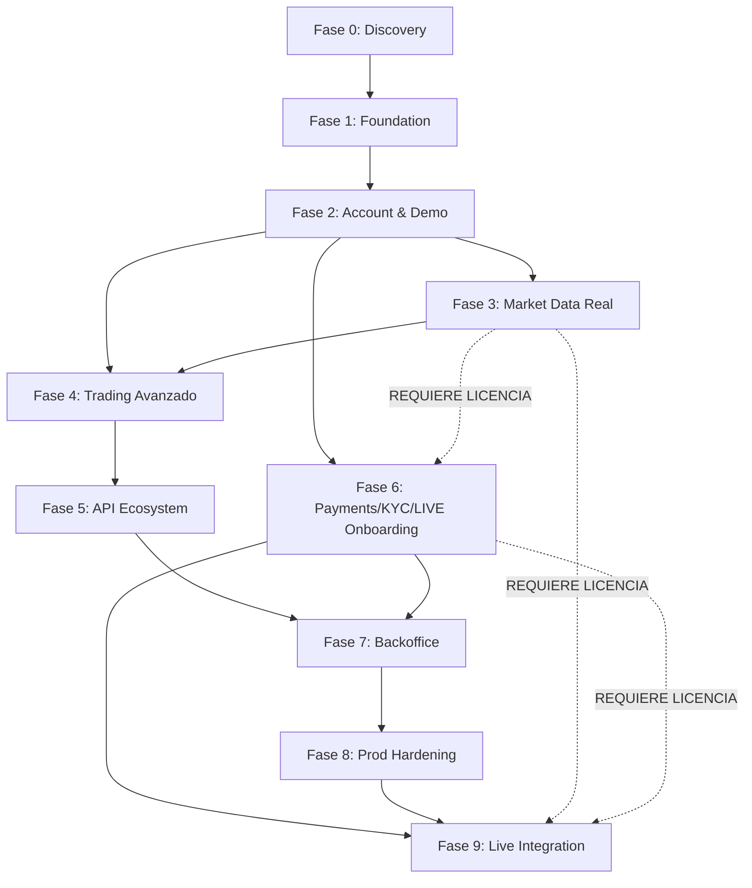

# T — Roadmap Fase 0 → 9

Fecha: 2026-09-27 · Fase 0 · Estado: `IMPLEMENTADO` (documento)

> **Principio**: Sin fechas inventadas. Cada fase avanza cuando se cumple su **Gate de Salida** (criterios medibles). Las dependencias externas (`REQUIERE PROVEEDOR`, `REQUIERE LICENCIA`) son gates duros.

---

## 0. Fase 0 — Discovery & Architecture (ACTUAL)

| Aspecto | Detalle |
|---------|---------|
| **Objetivo** | Definir arquitectura, decisiones canónicas, catálogo de servicios, stack, gobernanza de datos, telemetría, MVP scope y roadmap. Entregar documentos A–Z + ADRs base para aprobación. |
| **Entregables** | `docs/phase0/` → `00-decisions.md`, `A-executive-summary.md`, `B-requirements-matrix.md`, `C-gap-analysis.md`, `D-domain-map.md`, `E-c4-context.md`, `F-c4-containers.md`, `G-security-architecture.md`, `H-trading-architecture.md`, `I-payments-architecture.md`, `J-kyc-aml-architecture.md`, `K-market-data-architecture.md`, `L-ledger-architecture.md`, `M-tech-stack.md`, `N-monorepo-structure.md`, `O-database-strategy.md`, `P-event-catalog.md`, `Q-api-map.md`, `R-websocket-map.md`, `S-mvp-scope.md`, `T-roadmap.md`, `U-external-dependencies.md`, `V-risk-register.md`, `W-build-now.md`, `X-blocked-to-live.md`, `Y-complexity.md` + `docs/adr/ADR-0001…ADR-0020`. |
| **Servicios Implicados** | Ninguno (solo documentación). |
| **Dependencias Externas** | Ninguna. |
| **Gate de Salida** | ✅ 28 documentos phase0 aprobados por usuario · ✅ ADRs 0001–0020 firmados · ✅ Checklist `Z-signoff.md` completado. |
| **Riesgos Principales** | Scope creep en requisitos (74 secciones en `B-requirements.md`); decisiones postergadas que bloquean Fase 1 (`DECIDIR` en `Y-open-questions.md`); inconsistencia entre documentos. |

---

## 1. Fase 1 — Foundation (AUTORIZADA)

| Aspecto | Detalle |
|---------|---------|
| **Objetivo** | Monorepo ejecutable localmente: infra (PostgreSQL, Redis, Redpanda, OTel, Prom/Grafana/Loki/Tempo), gateway, identity, audit, apps/web (PWA), apps/admin-shell, CI/CD, tests, observabilidad básica. **Sin lógica de trading ni dinero real.** |
| **Entregables** | Monorepo `platform/` con `apps/web`, `apps/admin-shell`, `services/gateway`, `services/identity`, `services/audit`, `packages/*` (shared), `infrastructure/` (docker-compose, K8s manifests base, Terraform estructura), `.github/workflows/`, `docs/adr/` actualizados, `CHANGELOG.md`. |
| **Servicios Implicados** | `gateway`, `identity`, `audit` (código + tests + deploy compose) + `market-data` (2026-09-28: snapshot informativo `GET /api/v1/market-data/overview` con proveedores keyless — adelanto parcial de la Fase 3; sin ticks/WS/symbol master). |
| **Dependencias Externas** | **Object Storage (S3-compatible): `REQUIERE PROVEEDOR`** → placeholder + adapter mock en Fase 1. **Secrets Manager (Vault/KMS): `REQUIERE PROVEEDOR`** → env local en Fase 1. |
| **Gate de Salida** | ✅ `docker compose up -d` → todos healthy · ✅ `pnpm turbo run lint typecheck test` verde · ✅ GitHub Actions CI pasa en PR · ✅ E2E auth flow (register→verify→login→refresh→logout) passing · ✅ Dashboards RED en Grafana con datos reales · ✅ Traza end-to-end en Tempo · ✅ Logs estructurados en Loki · ✅ Eventos identity en Redpanda consumidos por audit · ✅ Migraciones Alembic idempotentes · ✅ PWA Lighthouse ≥ 90 · ✅ Security headers en todas las respuestas · ✅ Rate limit + circuit breaker funcionando · ✅ Documentación actualizada (README, API docs, runbooks). |
| **Riesgos Principales** | Complejidad OTel/Prom/Grafana/Loki/Tempo en local (recursos); transactional outbox correctness (dual-write problem); JWT refresh rotation edge cases (replay, clock skew); PWA Service Worker caching strategies; Redis connection pooling bajo carga; Redpanda schema registry compatibility. |

---

## 2. Fase 2 — Account & Demo Trading Core

| Aspecto | Detalle |
|---------|---------|
| **Objetivo** | Cuenta demo funcional: creación, wallet (balances virtuales), ledger (double-entry inmutable), market data (mock adapter + WS streaming), trading (OMS/EMS demo: órdenes, ejecución simulada, posiciones, PnL tiempo real, SL/TP, cierre, historial), risk (límites demo, kill switch). |
| **Entregables** | Servicios `accounts`, `wallet`, `ledger`, `market-data`, `trading`, `risk`, `notification` (mock email/in-app). APIs versionadas (OpenAPI). Tests de contrato + integración + carga básica. Documentación de usuario (demo guide). |
| **Servicios Implicados** | `accounts`, `wallet`, `ledger`, `market-data`, `trading`, `risk`, `notification` (nuevos). `gateway`, `identity`, `audit` (existentes, extensiones). |
| **Dependencias Externas** | **Market Data Feed Real: `REQUIERE LICENCIA/REGULACIÓN`** → Fase 2 usa **solo adapter mock**. **Object Storage: `REQUIERE PROVEEDOR`** → statements/reportes en mock local. |
| **Gate de Salida** | ✅ Cuenta demo creada via API → saldo virtual visible · ✅ Ledger: asientos inmutables, conciliación balance = Σentries · ✅ Market data WS: ticks/candles 1m/5m/1h streaming a frontend · ✅ Orden market/limit/stop → ejecución simulada → posición abierta · ✅ PnL unrealized actualizado por tick · ✅ SL/TP trigger → cierre automático · ✅ Cierre manual → realized PnL en ledger/wallet · ✅ Historial órdenes/positions con filtros · ✅ API Key read-only + WS streaming · ✅ Statement mensual generado (mock S3) · ✅ Risk: límites notionales, max pos, kill switch funcionando · ✅ Tests de carga: 100 usuarios concurrentes, 100 ord/s, p99 < 200ms · ✅ Zero `float` en dinero: solo `Decimal`/`NUMERIC(38,18)` · ✅ Idempotencia en orders (Idempotency-Key) verificada. |
| **Riesgos Principales** | Correctitud ledger double-entry bajo concurrencia (race conditions); PnL calculation precision/rounding; WebSocket backpressure en market data; matching engine determinismo; risk evaluation latency en camino crítico; idempotency key storage growth; event schema evolution (Avro) sin breaking consumers. |

---

## 3. Fase 3 — Market Data Real (PENDIENTE AUTORIZACIÓN + PROVEEDOR)

| Aspecto | Detalle |
|---------|---------|
| **Objetivo** | Sustituir adapter mock por feeds reales (FX, CFD, índices, crypto). Normalización canónica, cache multi-nivel, streaming de baja latencia, histórico, symbol master, corporate actions. |
| **Entregables** | `market-data` con adapters reales (plugin architecture), symbol master service, historical data API, cache warming, failover entre proveedores, SLA monitoring. *(Adelanto 2026-09-28: snapshot público `overview` con 4 adapters keyless + failover + cache/breaker — `docs/API_INTEGRATIONS.md`; ticks/WS/histórico/symbol master siguen aquí.)* |
| **Servicios Implicados** | `market-data` (refactor mayor), `trading` (consume real prices), `risk` (real-time marks). |
| **Dependencias Externas** | **Market Data Provider(s): `REQUIERE LICENCIA/REGULACIÓN`** (contrato, SLA, costos, redistribución rights). **Colocation/Proximity: `DECIDIR`** (latencia vs costo). |
| **Gate de Salida** | ✅ 2+ proveedores integrados con failover automático · ✅ Latencia p99 tick→WS client < 50ms (red local) · ✅ Symbol master: 10k+ símbolos, corporate actions aplicadas · ✅ Histórico: 5 años ticks/candles queryable · ✅ Cache hit rate > 99% para símbolos activos · ✅ Failover < 500ms sin pérdida de ticks · ✅ Costos/mes dentro de presupuesto aprobado · ✅ Compliance: redistribución rights verificadas legalmente. |
| **Riesgos Principales** | Costos de feeds (sorpresas en overage); vendor lock-in (mitigar con adapter pattern); data quality (gaps, spikes, stale); licencias de redistribución a clientes; schema changes de proveedor sin aviso; capacity planning para picos (NFP, earnings). |

---

## 4. Fase 4 — Trading Demo Completo + Automatización (PENDIENTE)

| Aspecto | Detalle |
|---------|---------|
| **Objetivo** | Trading demo feature-complete: tipos de orden avanzados (OCO, bracket, trailing), partial fills, multi-leg, portfolio margin demo, PnL attribution, backtesting API, strategy sandbox (Python/JS), webhooks para execution reports. |
| **Entregables** | `trading` extendido, `risk` portfolio margin, `market-data` historical replay, `notification` webhooks, `admin` MFEs para monitoring trading. |
| **Servicios Implicados** | `trading`, `risk`, `market-data`, `notification`, `admin`. |
| **Dependencias Externas** | Ninguna nueva (usa Fase 2/3). |
| **Gate de Salida** | ✅ OCO/bracket/trailing orders funcionando · ✅ Partial fills + average price correcto · ✅ Multi-leg (spreads, straddles) PnL agregado · ✅ Portfolio margin demo (risk-based) · ✅ Backtesting API: replay historical → same results · ✅ Strategy sandbox: user code aislado (WebAssembly/VM), resource limits · ✅ Webhooks: execution reports con firma, retry exponential backoff · ✅ Admin MFE: real-time positions, risk exposure, PnL by desk. |
| **Riesgos Principales** | Complejidad portfolio margin (cálculo NPV, Greeks); strategy sandbox security (escape, resource exhaustion); backtesting determinismo vs producción; webhook delivery guarantees (at-least-once + idempotency). |

---

## 5. Fase 5 — Automatización & API Ecosystem (PENDIENTE)

| Aspecto | Detalle |
|---------|---------|
| **Objetivo** | API pública completa: OpenAPI 3.1, SDKs (Python, JS, Rust), rate limiting por tier, API keys con scopes granulares, OAuth2/OIDC para third-party apps, developer portal, sandbox environment. |
| **Entregables** | `gateway` OAuth2/OIDC provider, developer portal (docs, API explorer, key management), SDKs generados, sandbox aislado (datos sintéticos), rate limit tiers, analytics de uso API. |
| **Servicios Implicados** | `gateway` (extendido), `identity` (OAuth2/OIDC), `admin` (developer portal BFF), nuevo `packages/sdks-*`. |
| **Dependencias Externas** | **OIDC Provider (Keycloak/Auth0/own): `DECIDIR`** → evaluar build vs buy. |
| **Gate de Salida** | ✅ OAuth2 Authorization Code + PKCE flow · ✅ Client credentials para server-to-server · ✅ Scopes granulares (read:account, trade:demo, read:market) · ✅ Developer portal: docs, try-it, key rotation, analytics · ✅ SDKs: Python/JS/Rust published to registries · ✅ Sandbox: datos sintéticos, reset automático, sin side effects · ✅ Rate limit tiers: free/pro/enterprise configurables · ✅ API versioning policy documentada y enforceada. |
| **Riesgos Principales** | OAuth2/OIDC implementation correctness (PKCE, token exchange, refresh); sandbox isolation (data leakage); SDK maintenance burden (generación automática desde OpenAPI); rate limit evasion; developer support load. |

---

## 6. Fase 6 — Payments, KYC/AML & Onboarding Real (PENDIENTE AUTORIZACIÓN + PROVEEDORES)

| Aspecto | Detalle |
|---------|---------|
| **Objetivo** | Onboarding real: KYC/AML orquestado, pagos (depósitos/retiros) multi-rail (card, bank transfer, crypto, PSP), compliance reporting, sanctions screening, ongoing monitoring. |
| **Entregables** | Servicios `kyc`, `payments` con adapters reales. Decision engine KYC, document verification, PEP/sanctions screening, transaction monitoring, SAR filing. PSP adapters (Stripe, Adyen, local), crypto (Fireblocks/Coinbase Prime/own), bank (SWIFT/SEPA/local). Reconciliation engine. |
| **Servicios Implicados** | `kyc`, `payments`, `identity` (extendido), `accounts` (estado KYC), `wallet` (balances reales), `ledger` (fuente verdad), `notification` (webhooks/email/SMS), `audit` (compliance logs), `admin` (compliance MFEs). |
| **Dependencias Externas** | **KYC Provider: `REQUIERE PROVEEDOR`** (Jumio, Onfido, Sumsub, Veriff, local). **PSP: `REQUIERE PROVEEDOR`** (contratos, volúmenes, rolling reserve). **Crypto Custody: `REQUIERE PROVEEDOR`** (Fireblocks, Copper, own MPC). **Banking: `REQUIERE LICENCIA/REGULACIÓN`** (cuentas segregadas, safeguarding). **Sanctions Screening: `REQUIERE PROVEEDOR`** (Dow Jones, Refinitiv, ComplyAdvantage). |
| **Gate de Salida** | ✅ KYC flow: documento + selfie → decisión < 3 min (auto) / < 24h (manual) · ✅ Sanctions/PEP screening en onboarding + ongoing · ✅ Depósito card/bank/crypto → credited en ledger < SLA · ✅ Retiro → processed + compliance check < SLA · ✅ Reconciliation: 100% match diario ledger vs PSP/bank/crypto · ✅ SAR/CTR filing automated (jurisdicción) · ✅ Rolling reserve / safeguarding accounting correcto · ✅ PCI DSS SAQ-A (si card) / PCI DSS Level 1 (si directo) · ✅ Audit trail completo: onboarding → KYC → deposit → trade → withdraw. |
| **Riesgos Principales** | **Regulatorio**: licencia/autorización (EMI, PI, MTL, broker-dealer) — **gate duro**; **Proveedores**: concentración (single PSP), rolling reserves, chargebacks, fraud; **Operacional**: reconciliation breaks, settlement delays, crypto chain reorgs; **Compliance**: AML/CTF program effectiveness, auditoría externa; **Costos**: KYC per-check, PSP fees, crypto custody fees. |

---

## 7. Fase 7 — Backoffice & Operations (PENDIENTE)

| Aspecto | Detalle |
|---------|---------|
| **Objetivo** | Backoffice completo: user management, account lifecycle, trading operations, risk monitoring, compliance cases, financial reporting, support tooling, audit trail search, feature flag management, config management. |
| **Entregables** | `admin` BFF + MFEs (React/Next.js): `admin-users`, `admin-accounts`, `admin-trading`, `admin-risk`, `admin-compliance`, `admin-finance`, `admin-support`, `admin-config`. RBAC granular (maker/checker). |
| **Servicios Implicados** | `admin` (nuevo BFF), `admin-shell` (host MFEs), todos los servicios (read-only APIs para admin). |
| **Dependencias Externas** | Ninguna nueva. |
| **Gate de Salida** | ✅ Todos los MFEs funcionales con datos reales · ✅ Maker/Checker workflows (aprobación retiros, límites, KYC override) · ✅ Búsqueda audit trail: correlation_id, user, date, event type < 2s · ✅ Financial reports: P&L, balance sheet, trial balance, client money segregation · ✅ Feature flags UI: toggle, rollout %, targeting · ✅ Config management: versionado, audit, rollback · ✅ Support tools: impersonation (auditado), session revocation, account freeze. |
| **Riesgos Principales** | Data access governance (admin ve PII/PHI); maker/checker bypass risk; performance de queries agregadas cross-service; config drift entre entornos. |

---

## 8. Fase 8 — Production Hardening (PENDIENTE)

| Aspecto | Detalle |
|---------|---------|
| **Objetivo** | Preparar para producción real: HA multi-AZ, DR, security hardening, chaos engineering, capacity planning, runbooks, incident response, compliance evidence package, penetration test, load test at scale. |
| **Entregables** | K8s manifests producción (Helm/Kustomize), Terraform modules (AWS/GCP/Azure), DR runbook (RPO/RTO), chaos experiments (Litmus/Gremlin), pen test report + remediation, load test report (10x expected peak), SOC2 Type II evidence, GDPR/CCPA compliance pack, runbooks por servicio. |
| **Servicios Implicados** | Todos (infra + aplicación). |
| **Dependencias Externas** | **Cloud Provider: `REQUIERE PROVEEDOR`** (cuenta, quotas, enterprise support). **Pen Test Firm: `REQUIERE PROVEEDOR`**. **Compliance Auditor: `REQUIERE PROVEEDOR`**. |
| **Gate de Salida** | ✅ K8s: multi-AZ, PodDisruptionBudgets, HPA/VPA, network policies, mTLS (Istio/Linkerd `DECIDIR`) · ✅ DR: RPO < 1h, RTO < 4h probado (failover drill) · ✅ Chaos: experimentos pasando (pod kill, zone loss, network partition, clock drift) · ✅ Pen test: 0 critical, 0 high, mediums remediados · ✅ Load test: 10x peak sostenido 1h, p99 < 500ms, 0% error rate · ✅ SOC2 Type II: evidence package listo · ✅ Runbooks: 100% servicios cubiertos, on-call rotation, escalation · ✅ Secrets: Vault/KMS en producción, rotation automática · ✅ Backup/restore: PostgreSQL PITR, Redpanda tiered storage, S3 versioning probado. |
| **Riesgos Principales** | Cloud cost overruns (capacity planning); mTLS complexity (cert rotation, MTU); DR test downtime window; pen test scope creep; compliance evidence gathering manual effort; on-call burnout prevention. |

---

## 9. Fase 9 — Live Integration & Go-Live (PENDIENTE AUTORIZACIÓN + LICENCIA)

| Aspecto | Detalle |
|---------|---------|
| **Objetivo** | Activar `LIVE` trading: conectar execution venues/brokers, liquidity providers, prime broker, clearing, custodian. Feature flag `live_trading = true` solo tras aprobación legal/compliance/board. Primeros clientes reales (beta controlado), ramp progresivo. |
| **Entregables** | `trading` + `risk` + `market-data` + `payments` + `ledger` + `accounts` + `kyc` en modo LIVE. Execution adapters (FIX/REST), smart order routing, best execution monitoring, trade reporting (MiFIR/EMIR/CFTC), client money segregation accounting, regulatory reporting pipeline. |
| **Servicios Implicados** | Todos (modo LIVE). Nuevos: `execution` adapters, `reporting` regulatory. |
| **Dependencias Externas** | **Licencia/Autorización Regulatoria: `REQUIERE LICENCIA/REGULACIÓN`** (gate duro, sin excepción). **Execution Venues/Brokers: `REQUIERE PROVEEDOR`** (FIX connectivity, legal agreements). **Prime Broker/Custodian: `REQUIERE PROVEEDOR`**. **Clearing House: `REQUIERE LICENCIA/REGULACIÓN`**. **Regulatory Reporting: `REQUIERE PROVEEDOR`** (ARM/APA/TR). **Insurance: `REQUIERE PROVEEDOR`** (PI, cyber, D&O). |
| **Gate de Salida** | ✅ Licencia/autorización regulatoria vigente · ✅ Contratos ejecución/clearing/custodia firmados · ✅ FIX connectivity certificado (FIX 4.4/5.0, session level) · ✅ Best execution: monitoring + reporting (RTS 27/28) · ✅ Trade reporting: transaction reporting + transparency automática · ✅ Client money: cuentas segregadas, reconciliation daily, CASS/equivalent audit · ✅ Beta: 50-100 usuarios reales, 30 días, 0 incidentes severos · ✅ Ramp plan: % tráfico live incremental, rollback criteria definidos · ✅ Incident response: < 15min detection, < 1h resolution para SEV-1 · ✅ Board sign-off documentado. |
| **Riesgos Principales** | **Regulatorio**: licencia denegada/retardada (proyecto se queda en DEMO perpetuo); **Ejecución**: latency, fill quality, venue outages; **Liquidez**: proveedores retiran liquidez en estrés; **Operacional**: settlement fails, corporate actions errors; **Reputacional**: primer incidente live; **Financiero**: capital requirements, P&L volatility. |

---

## 10. Matriz de Dependencias entre Fases

**Leyenda**: `→` = dependencia dura (secuencial); `-.->` = dependencia externa (proveedor/licencia) que puede paralelizarse pero bloquea gate.

---

## 11. Resumen de Gates Duros (Bloqueantes)

| Gate | Fase | Tipo | Descripción |
|------|------|------|-------------|
| **G0** | 0 | Interno | 28 docs + ADRs aprobados |
| **G1** | 1 | Interno | Compose up + CI verde + E2E auth + observabilidad |
| **G2** | 2 | Interno | Demo trading funcional + ledger conciliado + load test |
| **G3** | 3 | **Externo** | Contrato + licencia market data feed firmados |
| **G4** | 4 | Interno | Trading demo feature-complete + backtesting |
| **G5** | 5 | Interno | OAuth2 + Developer portal + SDKs publicados |
| **G6** | 6 | **Externo** | Contratos KYC + PSP + Crypto + Banking + Sanctions firmados |
| **G7** | 7 | Interno | Backoffice MFEs funcionales + maker/checker |
| **G8** | 8 | Interno + Externo | DR probado + Chaos passing + Pen test limpio + SOC2 evidence |
| **G9** | 9 | **Externo** | **Licencia regulatoria vigente** + contratos ejecución/clearing + beta exit criteria |

---

## 12. Riesgos Transversales (Afectan Múltiples Fases)

| Riesgo | Impacto | Mitigación |
|--------|---------|------------|
| **Scope creep** | Todas | Fases estrictas, clasificación honesta (`IMPLEMENTADO`/`PENDIENTE`/`MOCK`), `00-decisions.md` §9 |
| **Deuda técnica oculta** | 1→9 | ADR obligatorio para decisiones arquitectónicas; code review + static analysis en CI; refactor budget 20% por fase |
| **Dependencia proveedor único** | 3, 6, 9 | Adapter pattern obligatorio; evaluar 2+ proveedores por categoría; contract break clauses |
| **Regulatorio cambiante** | 6, 9 | Legal review por fase; compliance-as-code (OPA/Rego para políticas); audit trail inmutable |
| **Talento especializado** | 2, 3, 4, 6, 9 | Hiring plan alineado a fases; knowledge sharing docs; bus factor > 1 por servicio crítico |
| **Costos cloud/fees proveedores** | 3, 6, 8, 9 | Budget por fase; alertas costos; derechos de auditoría en contratos; multi-cloud strategy `DECIDIR` |
| **Seguridad supply chain** | 1→9 | SBOM (Syft/Grype), signed images (cosign), dependabot/renovate, pinned dependencies, no `latest` tags |
| **Data quality / lineage** | 2, 3, 4, 6, 9 | `data-governance` skill aplicada; contracts versionados; schema registry; data quality tests en CI |

---

## 13. Criterios de Priorización (Scoring para Decisiones de Trade-off)

Cuando surja un trade-off (ej. rendimiento vs consistencia, build vs buy, alcance vs fecha), usar:

| Criterio | Peso | Pregunta |
|----------|------|----------|
| **Integridad Financiera** | 10 | ¿Compromete la exactitud del ledger/saldos? |
| **Seguridad** | 9 | ¿Aumenta superficie de ataque o debilita controles? |
| **Cumplimiento Legal/Regulatorio** | 8 | ¿Bloquea licencia o genera incumplimiento? |
| **Correctitud Funcional** | 7 | ¿Rompe casos de uso core (demo o live)? |
| **Auditabilidad** | 6 | ¿Pierde trazabilidad o inmutabilidad requerida? |
| **Disponibilidad** | 5 | ¿SPOF? ¿Degradación graceful? |
| **Rendimiento** | 4 | ¿p99 latencia dentro de SLO? |
| **Escalabilidad** | 3 | ¿Soporta 10x sin redesign? |
| **UX** | 2 | ¿Fricción innecesaria para usuario? |
| **Velocidad de Desarrollo** | 1 | ¿Acelera o frena delivery? |

**Regla**: Nunca sacrificar un criterio de peso mayor por uno menor sin ADR documentado y firmado.

---

## 14. Próximos Pasos Inmediatos (Post-Fase 0)

1. **Usuario aprueba Fase 0** → firma `Z-signoff.md`.
2. **Ejecutar Fase 1** según plan en `docs/adr/0001-monorepo-structure.md` y `docs/adr/0003-microservices-catalog.md`.
3. **Semana 1-2**: Monorepo scaffolding + docker-compose + CI/CD + PostgreSQL/Redis/Redpanda.
4. **Semana 3-4**: Gateway + Identity + Audit (código + tests + eventos).
5. **Semana 5-6**: apps/web PWA + apps/admin-shell + Observabilidad completa.
6. **Semana 7**: Gate G1 verification → documentación actualizada → planificar Fase 2.

---

> **Nota**: Este roadmap es **dirigido por gates, no por calendario**. Las fases 3, 6, 9 tienen gates duros externos (`REQUIERE PROVEEDOR/LICENCIA`) que determinan su inicio real. Las fases 1, 2, 4, 5, 7, 8 son internas y secuenciales.